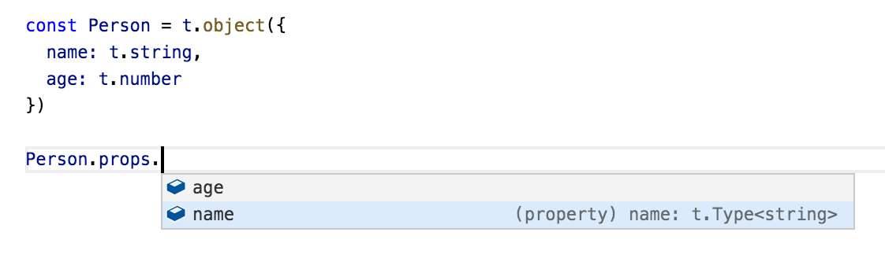
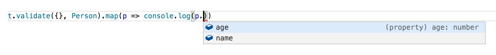

[](https://travis-ci.org/gcanti/io-ts)
[](https://david-dm.org/gcanti/io-ts)


# The idea

Blog post: ["Typescript and validations at runtime boundaries"](https://lorefnon.tech/2018/03/25/typescript-and-validations-at-runtime-boundaries/) by [@lorefnon](https://github.com/lorefnon)

A value of type `Type<A, O, I>` (called "runtime type") is the runtime representation of the static type `A`.

Also a runtime type can

- decode inputs of type `I` (through `decode`)
- encode outputs of type `O` (through `encode`)
- be used as a custom type guard (through `is`)

```ts
export type mixed = object | number | string | boolean | symbol | undefined | null

class Type<A, O = A, I = mixed> {
  readonly _A: A
  readonly _O: O
  readonly _I: I
  constructor(
    /** a unique name for this runtime type */
    readonly name: string,
    /** a custom type guard */
    readonly is: (v: mixed) => v is A,
    /** succeeds if a value of type I can be decoded to a value of type A */
    readonly validate: (input: I, context: Context) => Either<Errors, A>,
    /** converts a value of type A to a value of type O */
    readonly encode: (a: A) => O
  ) {}
  /** a version of `validate` with a default context */
  decode(i: I): Either<Errors, A>
}
```

Note. The `Either` type is defined in [fp-ts](https://github.com/gcanti/fp-ts), a library containing implementations of
common algebraic types in TypeScript.

**Example**

A runtime type representing `string` can be defined as

```ts
import * as t from 'io-ts'

// runtime type definition
export class StringType extends t.Type<string> {
  // equivalent to Type<string, string, mixed> as per type parameter defaults
  readonly _tag: 'StringType' = 'StringType'
  constructor() {
    super(
      'string',
      (m): m is string => typeof m === 'string',
      (m, c) => (this.is(m) ? t.success(m) : t.failure(m, c)),
      t.identity
    )
  }
}

// runtime type instance: use this when building other runtime types instances
export const string = new StringType()
```

A runtime type can be used to validate an object in memory (for example an API payload)

```ts
const Person = t.type({
  name: t.string,
  age: t.number
})

// validation succeeded
Person.decode(JSON.parse('{"name":"Giulio","age":43}')) // => Right({name: "Giulio", age: 43})

// validation failed
Person.decode(JSON.parse('{"name":"Giulio"}')) // => Left([...])
```

# TypeScript compatibility

The stable version is tested against TypeScript 3.0.1, but should run with TypeScript 2.7.2+ too

# Error reporters

A reporter implements the following interface

```ts
interface Reporter<A> {
  report: (validation: Validation<any>) => A
}
```

This package exports two default reporters

- `PathReporter: Reporter<Array<string>>`
- `ThrowReporter: Reporter<void>`

Example

```ts
import { PathReporter } from 'io-ts/lib/PathReporter'
import { ThrowReporter } from 'io-ts/lib/ThrowReporter'

const result = Person.decode({ name: 'Giulio' })

console.log(PathReporter.report(result))
// => ['Invalid value undefined supplied to : { name: string, age: number }/age: number']

ThrowReporter.report(result)
// => throws 'Invalid value undefined supplied to : { name: string, age: number }/age: number'
```

You can define your own reporter. `Errors` has the following type

```ts
interface ContextEntry {
  readonly key: string
  readonly type: Decoder<any, any>
}
type Context = ReadonlyArray<ContextEntry>
interface ValidationError {
  readonly value: mixed
  readonly context: Context
}
type Errors = Array<ValidationError>
```

Example

```ts
import * as t from 'io-ts'

const getPaths = <A>(v: t.Validation<A>): Array<string> => {
  return v.fold(errors => errors.map(error => error.context.map(({ key }) => key).join('.')), () => ['no errors'])
}

const Person = t.type({
  name: t.string,
  age: t.number
})

console.log(getPaths(Person.decode({}))) // => [ '.name', '.age' ]
```

# Community

- [io-ts-types](https://github.com/gcanti/io-ts-types) - A collection of runtime types and combinators for use with
  io-ts
- [io-ts-reporters](https://github.com/OliverJAsh/io-ts-reporters) - Error reporters for io-ts
- [geojson-iots](https://github.com/pierremarc/geojson-iots) - Runtime types for GeoJSON as defined in rfc7946 made with
  io-ts
- [graphql-to-io-ts](https://github.com/micimize/graphql-to-io-ts) - Generate typescript and cooresponding io-ts types from a graphql
  schema

# TypeScript integration

Runtime types can be inspected



This library uses TypeScript extensively. Its API is defined in a way which automatically infers types for produced
values



Note that the type annotation isn't needed, TypeScript infers the type automatically based on a schema.

Static types can be extracted from runtime types using the `TypeOf` operator

```ts
interface IPerson extends t.TypeOf<typeof Person> {}

// same as
interface IPerson {
  name: string
  age: number
}
```

# Implemented types / combinators

```ts
import * as t from 'io-ts'
```

| Type                      | TypeScript                              | Runtime type / combinator                             |
| ------------------------- | --------------------------------------- | ----------------------------------------------------- |
| null                      | `null`                                  | `t.null` or `t.nullType`                              |
| undefined                 | `undefined`                             | `t.undefined`                                         |
| void                      | `void`                                  | `t.void` or `t.voidType`                              |
| string                    | `string`                                | `t.string`                                            |
| number                    | `number`                                | `t.number`                                            |
| boolean                   | `boolean`                               | `t.boolean`                                           |
| any                       | `any`                                   | `t.any`                                               |
| never                     | `never`                                 | `t.never`                                             |
| object                    | `object`                                | `t.object`                                            |
| integer                   | ✘                                       | `t.Integer`                                           |
| array of any              | `Array<mixed>`                          | `t.Array`                                             |
| array of type             | `Array<A>`                              | `t.array(A)`                                          |
| dictionary of any         | `{ [key: string]: mixed }`              | `t.Dictionary`                                        |
| dictionary of type        | `{ [K in A]: B }`                       | `t.dictionary(A, B)`                                  |
| function                  | `Function`                              | `t.Function`                                          |
| literal                   | `'s'`                                   | `t.literal('s')`                                      |
| partial                   | `Partial<{ name: string }>`             | `t.partial({ name: t.string })`                       |
| readonly                  | `Readonly<T>`                           | `t.readonly(T)`                                       |
| readonly array            | `ReadonlyArray<number>`                 | `t.readonlyArray(t.number)`                           |
| type alias                | `type A = { name: string }`             | `t.type({ name: t.string })`                          |
| tuple                     | `[ A, B ]`                              | `t.tuple([ A, B ])`                                   |
| union                     | `A \| B`                                | `t.union([ A, B ])` or `t.taggedUnion(tag, [ A, B ])` |
| intersection              | `A & B`                                 | `t.intersection([ A, B ])`                            |
| keyof                     | `keyof M`                               | `t.keyof(M)`                                          |
| recursive types           | see [Recursive types](#recursive-types) | `t.recursion(name, definition)`                       |
| refinement                | ✘                                       | `t.refinement(A, predicate)`                          |
| exact types               | ✘                                       | `t.exact(type)`                                       |
| strict types (deprecated) | ✘                                       | `t.strict({ name: t.string })`                        |

# Recursive types

Recursive types can't be inferred by TypeScript so you must provide the static type as a hint

```ts
// helper type
interface ICategory {
  name: string
  categories: Array<ICategory>
}

const Category = t.recursion<ICategory>('Category', Category =>
  t.type({
    name: t.string,
    categories: t.array(Category)
  })
)
```

## Mutually recursive types

```ts
interface IFoo {
  type: 'Foo'
  b: IBar | undefined
}

interface IBar {
  type: 'Bar'
  a: IFoo | undefined
}

const Foo: t.RecursiveType<t.Type<IFoo>, IFoo> = t.recursion<IFoo>('Foo', _ =>
  t.interface({
    type: t.literal('Foo'),
    b: t.union([Bar, t.undefined])
  })
)

const Bar: t.RecursiveType<t.Type<IFoo>, IBar> = t.recursion<IBar>('Bar', _ =>
  t.interface({
    type: t.literal('Bar'),
    a: t.union([Foo, t.undefined])
  })
)

const FooBar = t.taggedUnion('type', [Foo, Bar])
```

# Tagged unions

If you are encoding tagged unions, instead of the general purpose `union` combinator, you may want to use the
`taggedUnion` combinator in order to get better performances

```ts
const A = t.type({
  tag: t.literal('A'),
  foo: t.string
})

const B = t.type({
  tag: t.literal('B'),
  bar: t.number
})

// the actual presence of the tag is statically checked
const U = t.taggedUnion('tag', [A, B])
```

# Refinements

You can refine a type (_any_ type) using the `refinement` combinator

```ts
const Positive = t.refinement(t.number, n => n >= 0, 'Positive')

const Adult = t.refinement(Person, person => person.age >= 18, 'Adult')
```

# Exact types

You can make a runtime type alias exact (which means that only the given properties are allowed) using the `exact` combinator

```ts
const Person = t.type({
  name: t.string,
  age: t.number
})

const ExactPerson = t.exact(Person)

Person.decode({ name: 'Giulio', age: 43, surname: 'Canti' }) // ok
ExactPerson.decode({ name: 'Giulio', age: 43, surname: 'Canti' }) // fails
```

# Strict types (deprecated)

**Note**. This combinator is deprecated, use `exact` instead.

You can make a runtime type strict (which means that only the given properties are allowed) using the `strict` combinator

```ts
const Person = t.type({
  name: t.string,
  age: t.number
})

const StrictPerson = t.strict(Person.props)

Person.decode({ name: 'Giulio', age: 43, surname: 'Canti' }) // ok
StrictPerson.decode({ name: 'Giulio', age: 43, surname: 'Canti' }) // fails
```

# Mixing required and optional props

You can mix required and optional props using an intersection

```ts
const A = t.type({
  foo: t.string
})

const B = t.partial({
  bar: t.number
})

const C = t.intersection([A, B])

interface CT extends t.TypeOf<typeof C> {}

// same as
type CT = {
  foo: string
  bar?: number
}
```

You can apply `partial` to an already defined runtime type via its `props` field

```ts
const Person = t.type({
  name: t.string,
  age: t.number
})

const PartialPerson = t.partial(Person.props)

interface PartialPerson extends t.TypeOf<typeof PartialPerson> {}

// same as
interface PartialPerson {
  name?: string
  age?: number
}
```

# Custom types

You can define your own types. Let's see an example

```ts
import * as t from 'io-ts'

// represents a Date from an ISO string
const DateFromString = new t.Type<Date, string>(
  'DateFromString',
  (m): m is Date => m instanceof Date,
  (m, c) =>
    t.string.validate(m, c).chain(s => {
      const d = new Date(s)
      return isNaN(d.getTime()) ? t.failure(s, c) : t.success(d)
    }),
  a => a.toISOString()
)

const s = new Date(1973, 10, 30).toISOString()

DateFromString.decode(s)
// right(new Date('1973-11-29T23:00:00.000Z'))

DateFromString.decode('foo')
// left(errors...)
```

Note that you can **deserialize** while validating.

# Tips and Tricks

## Is there a way to turn the checks off in production code?

No, however you can define your own logic for that (if you _really_ trust the input)

```ts
import * as t from 'io-ts'
import { Either, right } from 'fp-ts/lib/Either'

const { NODE_ENV } = process.env

export function unsafeDecode<A, O>(value: t.mixed, type: t.Type<A, O>): Either<t.Errors, A> {
  if (NODE_ENV !== 'production' || type.encode !== t.identity) {
    return type.decode(value)
  } else {
    // unsafe cast
    return right(value as A)
  }
}

// or...

import { failure } from 'io-ts/lib/PathReporter'

export function unsafeGet<A, O>(value: t.mixed, type: t.Type<A, O>): A {
  if (NODE_ENV !== 'production' || type.encode !== t.identity) {
    return type.decode(value).getOrElseL(errors => {
      throw new Error(failure(errors).join('\n'))
    })
  } else {
    // unsafe cast
    return value as A
  }
}
```

## Union of string literals

Use `keyof` instead of `union` when defining a union of string literals

```ts
const Bad = t.union([
  t.literal('foo'),
  t.literal('bar'),
  t.literal('baz')
  // etc...
])

const Good = t.keyof({
  foo: null,
  bar: null,
  baz: null
  // etc...
})
```

Benefits

- unique check for free
- better performance
- quick info stays responsive

# Known issues

VS Code might display weird types for nested types

```ts
const NestedInterface = t.type({
  foo: t.string,
  bar: t.type({
    baz: t.string
  })
})

type NestedInterfaceType = t.TypeOf<typeof NestedInterface>
/*
Hover on NestedInterfaceType will display

type NestedInterfaceType = {
    foo: string;
    bar: t.TypeOfProps<{
        baz: t.StringType;
    }>;
}

instead of

type NestedInterfaceType = {
  foo: string;
  bar: {
    baz: string
  }
}
*/
```

## Solution: the `clean` and `alias` functions

The pattern

```ts
// private runtime type
const _NestedInterface = t.type({
  foo: t.string,
  bar: t.type({
    baz: t.string
  })
})

// a type alias using interface
export interface NestedInterface extends t.TypeOf<typeof _NestedInterface> {}

//
// Two possible options for the exported runtime type
//

// a clean NestedInterface which drops the kind...
export const NestedInterface = t.clean<NestedInterface, NestedInterface>(_NestedInterface)
/*
NestedInterface: t.Type<NestedInterface, NestedInterface, t.mixed>
*/

// ... or an alias of _NestedInterface which keeps the kind
export const NestedInterface = t.alias(_NestedInterface)<NestedInterface, NestedInterface>()
/*
t.InterfaceType<{
    foo: t.StringType;
    bar: t.InterfaceType<{
        baz: t.StringType;
    }, t.TypeOfProps<{
        baz: t.StringType;
    }>, t.OutputOfProps<{
        baz: t.StringType;
    }>, t.mixed>;
}, NestedInterface, NestedInterface, t.mixed>
*/

// you can also alias the props
interface NestedInterfaceProps extends t.PropsOf<typeof _NestedInterface> {}
export const NestedInterface = t.alias(_NestedInterface)<NestedInterface, NestedInterface, NestedInterfaceProps>()
/*
const NestedInterface: t.InterfaceType<NestedInterfaceProps, NestedInterface, NestedInterface, t.mixed>
*/
```
