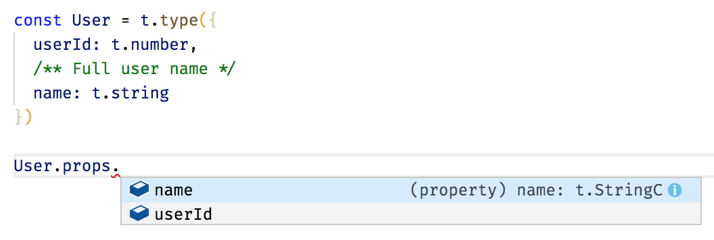

# The idea

A value of type `Type<T>` (called "runtime type") is the runtime representation of the static type `T`:

```js
export class Type<A> {
  readonly _A: A
  constructor(
    readonly name: string,
    readonly is: Is<A>,
    readonly validate: Validate<A>,
    readonly serialize: Serialize<A>
  ) {}
}
```

where `Validate<A>` is a specific validation function for the type `A`

```js
export type Is<A> = (value: any) => value is A
export type Validation<A> = Either<Array<ValidationError>, A>
export type Validate<A> = (value: any, context: Context) => Validation<A>
export type Serialize<A> = (value: A) => any
```

Note. The `Either` type is defined in [fp-ts](https://github.com/gcanti/fp-ts), a library containing implementations of common algebraic types in TypeScript.

**Example**

A runtime type representing `string` can be defined as

```js
import * as t from 'io-ts'

export class StringType extends Type<string> {
  constructor() {
    super(
      'string',
      (v): v is string => typeof v === 'string',
      (v, c) => (this.is(v) ? success(v) : failure(v, c)),
      v => v
    )
  }
}
```

A runtime type can be used to validate an object in memory (for example an API payload)

```js
const Person = t.interface({
  name: t.string,
  age: t.number
})

// ok
t.validate(JSON.parse('{"name":"Giulio","age":43}'), Person) // => Right({name: "Giulio", age: 43})

// ko
t.validate(JSON.parse('{"name":"Giulio"}'), Person) // => Left([...])
```

# Error reporters

A reporter implements the following interface

```js
interface Reporter<A> {
  report: (validation: Validation<any>) => A;
}
```

This package exports two default reporters

- `PathReporter: Reporter<Array<string>>`
- `ThrowReporter: Reporter<void>`

Example

```js
import { PathReporter } from 'io-ts/lib/PathReporter'
import { ThrowReporter } from 'io-ts/lib/ThrowReporter'

const validation = t.validate({"name":"Giulio"}, Person)

console.log(PathReporter.report(validation))
// => ['Invalid value undefined supplied to : { name: string, age: number }/age: number']

ThrowReporter.report(validation)
// => throws 'Invalid value undefined supplied to : { name: string, age: number }/age: number'
```

# Community

- [io-ts-reporters](https://github.com/OliverJAsh/io-ts-reporters) - Error reporters for io-ts
- [geojson-iots](https://github.com/pierremarc/geojson-iots) - Runtime types for GeoJSON as defined in rfc7946 made with io-ts

# TypeScript integration

Runtime types can be inspected



This library uses TypeScript extensively. Its API is defined in a way which automatically infers types for produced values


Note that the type annotation isn't needed, TypeScript infers the type automatically based on a schema.

Static types can be extracted from runtime types with the `TypeOf` operator

```js
type IPerson = t.TypeOf<typeof Person>

// same as
type IPerson = {
  name: string,
  age: number
}
```

## Recursive types

Note that recursive types can't be inferred

```js
// helper type
type ICategory = {
  name: string,
  categories: Array<ICategory>
}

const Category = t.recursion<ICategory>('Category', self =>
  t.interface({
    name: t.string,
    categories: t.array(self)
  })
)
```

# Implemented types / combinators

```js
import * as t from 'io-ts'
```

| Type | TypeScript annotation syntax | Runtime type / combinator |
|------|-------|-------------|
| null | `null` | `t.null` or `t.nullType` |
| undefined | `undefined` | `t.undefined` |
| string | `string` | `t.string` |
| number | `number` | `t.number` |
| boolean | `boolean` | `t.boolean` |
| any | `any` | `t.any` |
| never | `never` | `t.never` |
| object | `object` | `t.object` |
| integer | ✘ | `t.Integer` |
| array of any | `Array<any>` | `t.Array` |
| array of type | `Array<A>` | `t.array(A)` |
| dictionary of any | `{ [key: string]: any }` | `t.Dictionary` |
| dictionary of type | `{ [key: A]: B }` | `t.dictionary(A, B)` |
| function | `Function` | `t.Function` |
| literal | `'s'` | `t.literal('s')` |
| partial | `Partial<{ name: string }>` | `t.partial({ name: t.string })` |
| readonly | `Readonly<T>` | `t.readonly(T)` |
| readonly array | `ReadonlyArray<number>` | `t.readonlyArray(t.number)` |
| interface | `interface A { name: string }` | `t.interface({ name: t.string })` or `t.type({ name: t.string })` |
| interface inheritance | `interface B extends A {}` | `t.intersection([ A, t.interface({}) ])` |
| tuple | `[ A, B ]` | `t.tuple([ A, B ])` |
| union | `A \| B` | `t.union([ A, B ])` |
| intersection | `A & B` | `t.intersection([ A, B ])` |
| keyof | `keyof M` | `t.keyof(M)` |
| recursive types | see [Recursive types](#recursive-types) | `t.recursion(name, definition)` |
| refinement | ✘ | `t.refinement(A, predicate)` |
| strict | ✘ | `t.strict({ name: t.string })` |
| map (deprecated) | ✘ | `t.map(f, type)` |
| prism (deprecated) | ✘ | `t.prism(type, getOption)` |

# Refinements

You can refine a type (_any_ type) using the `refinement` combinator

```ts
const Positive = t.refinement(t.number, n => n >= 0, 'Positive')

const Adult = t.refinement(Person, person => person.age >= 18, 'Adult')
```

# Strict interfaces

You can make an interface strict (which means that only the given properties are allowed) using the `strict` combinator

```ts
const Person = t.interface({
  name: t.string,
  age: t.number
})

const StrictPerson = t.strict(Person.props)

t.validate({ name: 'Giulio', age: 43, surname: 'Canti' }, Person) // ok
t.validate({ name: 'Giulio', age: 43, surname: 'Canti' }, StrictPerson) // fails
```

# Mixing required and optional props

Note. You can mix required and optional props using an intersection

```ts
const A = t.interface({
  foo: t.string
})

const B = t.partial({
  bar: t.number
})

const C = t.intersection([A, B])

type CT = t.TypeOf<typeof C>

// same as
type CT = {
  foo: string,
  bar?: number
}
```

# Custom types

You can define your own types. Let's see an example

```ts
import * as t from 'io-ts'

// returns a Date from an ISO string
const DateFromString: t.Type<Date> = {
  _A: t._A,
  name: 'DateFromString',
  validate: (v, c) =>
    t.string.validate(v, c).chain(s => {
      const d = new Date(s)
      return isNaN(d.getTime()) ? t.failure<Date>(s, c) : t.success(d)
    })
}

const s = new Date(1973, 10, 30).toISOString()

t.validate(s, DateFromString)
// => Right(Date(..))

t.validate('foo', DateFromString)
// => Left( 'Invalid value "foo" supplied to : DateFromString' )
```

Note that you can **deserialize** while validating.

# Custom combinators

You can define your own combinators. Let's see some examples

## The `maybe` combinator

An equivalent to `T | null`

```ts
export function maybe<RT extends t.Any>(
  type: RT,
  name?: string
): t.UnionType<[RT, typeof t.null], t.TypeOf<RT> | null> {
  return t.union([type, t.null], name)
}
```

## The `brand` combinator

The problem

```ts
const payload = {
  celsius: 100,
  fahrenheit: 100
}

const Payload = t.interface({
  celsius: t.number,
  fahrenheit: t.number
})

// x can be anything
function naiveConvertFtoC(x: number): number {
  return (x - 32) / 1.8;
}

// typo: celsius instead of fahrenheit
console.log(t.validate(payload, Payload).map(x => naiveConvertFtoC(x.celsius))) // NO error :(
```

Solution (branded types)

```ts
export function brand<T, B extends string>(type: t.Type<T>, brand: B): t.Type<T & { readonly __brand: B }> {
  return type as any
}

const Fahrenheit = brand(t.number, 'Fahrenheit')
const Celsius = brand(t.number, 'Celsius')

type CelsiusT = t.TypeOf<typeof Celsius>
type FahrenheitT = t.TypeOf<typeof Fahrenheit>

const Payload2 = t.interface({
  celsius: Celsius,
  fahrenheit: Fahrenheit
})

// narrowed types
function convertFtoC(fahrenheit: FahrenheitT): CelsiusT {
  return ((fahrenheit - 32) / 1.8) as CelsiusT
}

console.log(t.validate(payload, Payload2).map(x => convertFtoC(x.celsius))) // error: Type '"Celsius"' is not assignable to type '"Fahrenheit"'
console.log(t.validate(payload, Payload2).map(x => convertFtoC(x.fahrenheit))) // ok
```

# Recipes

## Is there a way to turn the checks off in production code?

No, however you can define your own logic for that (if you *really* trust the input)

```ts
import * as t from 'io-ts'
import { failure } from 'io-ts/lib/PathReporter'

function unsafeValidate<T>(value: any, type: t.Type<T>): T {
  if (process.env.NODE_ENV !== 'production') {
    return t.validate(value, type).fold(errors => {
      throw new Error(failure(errors).join('\n'))
    }, x => x)
  }
  return value as T
}
```

# Known issues

Due to an upstream [bug](https://github.com/Microsoft/TypeScript/issues/14041), VS Code might display weird types for nested interfaces

```ts
const NestedInterface = t.interface({
  foo: t.interface({
    bar: t.string
  })
});

type NestedInterfaceType = t.TypeOf<typeof NestedInterface>;
/*
Hover on NestedInterfaceType will display

type NestedInterfaceType = {
  foo: t.InterfaceOf<{
    bar: t.StringType;
  }>;
}

instead of

type NestedInterfaceType = {
  foo: {
    bar: string;
  };
}
*/
```
